**This README provides an overview, screenshots, and design documentation. Please contact me if you are interested in full technical solution and source code. Thank you.**

## **FOI Management Suite**
*A Freedom of Information (FOI) request handling solution featuring Model-Driven and Canvas Apps, plus a Self-Service Power Pages portal.*

## **Overview**
The FOI Management Suite is a self-directed, enterprise-style portfolio system built on Microsoft Power Platform and Dynamics 365 Customer Service. It demonstrates how Freedom of Information (FOI) request processing can be modelled using Dataverse, model-driven applications, automation, and secure citizen-facing portals following public-sector delivery patterns.

The system integrates internal case management tools with a secure citizen-facing portal to demonstrate request intake, document handling, SLA monitoring, and compliance-oriented tracking.

**Design Outcomes:** Demonstrates how automated workflows, integrated self-service submission, and centralised case management can reduce manual handling effort and improve traceability in FOI workflows.

---

## **Key Features**

- **FOI Request Management:** End-to-end intake, triage, processing, status tracking, escalation, and closure of FOI requests.
- **Document Handling:** Upload, view, download, and manage FOI attachments securely stored in SharePoint.
- **Automated Workflows:** Automatic assignment, reminders, escalations, and requester notifications built into business processes.
- **User & Role Permissions:** Role-based access ensuring FOI officers, managers, and requesters only see relevant, authorised data.
- **Citizen Self-Service:** Power Pages portal allowing citizens to submit new FOI requests and track their status online.
- **Dashboards & Insights:** Real-time analytics for case volume, status distribution, processing times, and team performance.

---

## **Key Components**

1. **FOI Management – Model-Driven App**
   - Built on a custom Dataverse FOI Request table, with selective use of D365 Case entity features (queues, routing rules, escalation patterns) to align with Customer Service operational workflows.
   - Business Process Flow to guide FOI officers through request lifecycle.
   - SLA Alerts & out-of-the-box (OOB) SLA Timer control for compliance monitoring.
   - Custom PCF SLA Progress Bar that fills based on elapsed time between start and due dates, with automatic colour changes to indicate warning and overdue states.
   - Client-side JavaScript to enforce uppercase Department codes and warn if not exactly three characters.
   - C# Plugin for automated case number generation and server-side logic.
   - Utilises Dataverse FOI Escalation BPF views and charts, which are surfaced in the FOI Power BI dashboard.
   - Document Offloading to SharePoint: Response files are automatically moved from Dataverse to SharePoint via Power Automate, with Dataverse retaining metadata only for traceability.

2. **FOI Search & Upload – Canvas App**
   - Responsive layout supporting mobile and desktop devices.
   - Secure request search and document upload interface for internal staff.
   - SharePoint integration for document storage; Dataverse for metadata.
   - Immediate success/error feedback on uploads, with error logging built into relevant flows.

3. **Self-Service Citizen Portal – Power Pages**
   - Public-facing site for submitting FOI requests online and tracking status.
   - Request Details page using Liquid templates and FetchXML to display related data (e.g., assigned officer).
   - Page permissions for secure content access.
   - Web roles and table permissions for secure citizen interactions.
   - Sign Up, Sign In, and OOB Profile management features enabled.
   - Request Submission form implemented as OOB Basic Form.

For deeper technical patterns (ETL, async integrations, routing, observability, DevOps, and testing), see the **Enterprise Features** section below.

---

## **Automation Overview**
Automation covers three layers:

1. **Front-line automation**
   - Assignment
   - Notifications
   - SLA monitoring

2. **Document automation**
   - Upload pipeline
   - Folder creation
   - Metadata updates

3. **Background orchestration**
   - Email ingestion
   - Asynchronous validation
   - Audit logging
   - Integration workflows
   - Migration Run Tracking

All automation design notes are covered in the **Enterprise Features** section.  
   
A full catalogue of flows, triggers, and connectors is available in
[`/docs/automation-details.md`](./docs/automation-details.md).
For a visual representation to some of the flows, see the Data Flow Diagrams (DFD) in the `/docs/diagrams` folder.

---

## **Technical Highlights**
- **D365 Customer Service Case entity** customisation.
- **Business Process Flows** for structured case progression, including FOI Escalation BPF.
- **Custom PCF SLA Progress Bar control** for SLA visualisation.
- **Client-side JavaScript** for validation and formatting.
- **C# Plugin** for server-side automation.
- **Business Rules** for validation and automation.
- **Field-Level Security** applied to protect sensitive requester attributes.
- **Custom Action in Power Automate** to resolve cases from within the flow.
- **FetchXML** in both Power Automate and Power Pages Liquid templates.
- **Responsive Canvas App** design for mobile and desktop.
- **Liquid templates** for customised portal experiences.
- **Power BI**: Built with Power BI Desktop, including integration with Dataverse BPF views, charts, and dashboards.
- Additional enterprise-grade capabilities (DevOps automation, integration architecture, custom auditing, observability, queue routing) are detailed in the **Enterprise Features - High-Level Summary** section.

---

## **Tech Stack**
- **Microsoft Power Platform** - Model-Driven App, Canvas App, Power Pages, Power Automate
- **Microsoft Dataverse** - Core data platform
- **Dynamics 365 Customer Service** - Case management foundation
- **SharePoint Online** - Document storage and metadata
- **Power BI Desktop & Service** - Reporting and dashboards
- **PCF, C#, JavaScript, FetchXML, Liquid** - Customisation & development
- **Azure Services** - Webhook endpoint, Azure Function, Logic Apps, Service Bus
- **Data Integration** - Power Query / Dataflows
- **Testing** - xUnit, FakeXrmEasy

---

## **Developer Tooling**
- **LevelUp** – Dataverse metadata inspection, form diagnostics, and record navigation.
- **XrmToolBox: Plugin Trace Viewer** – Advanced plug-in execution diagnostics and trace log inspection.
- **XrmToolBox: Data Transporter** – Reference data migration between environments.

---

## Platform Governance & Security Controls

This section outlines the governance, security, and operational standards applied across environments to ensure compliance, stability, and controlled access in enterprise scenarios.

### Security Model
- Custom security roles for FOI Admin, Team Leader, Officer, and Auditor
- Hierarchy security using the Position model
- Dataverse table permissions for restricting record access
- Power Pages web roles for authenticated external access

### Governance & Environment Standards
- Data Loss Prevention (DLP) policies enforcing connector boundaries
- Environment Variables for consistent configuration across DEV/TEST
- Solution Checker used to validate components against best practices
- Power Platform Pipelines for controlled and traceable solution deployment

### Reliability & Error Handling
- Standardised error logging pattern capturing operation, record ID, flow source, and error details
- Automated folder creation and structured document handling using Dataverse to SharePoint flows
- Structured logging across Power Automate flows for traceability

### Reporting & Operational Insights
- FOI Case Analytics dashboard (status distribution, volume, time-to-resolution)
- FOI Escalation Process reporting using BPF Stage views and charts
- SLA tracking via PCF SLA Progress Bar and OOB SLA Timer

---

## How to Navigate This Repository

- `/docs/automation-details.md` - Full list of flows, connectors, triggers
- `/docs/enterprise-features/` - In-depth breakdowns of enterprise capabilities
- `/docs/diagrams/` - Architecture diagrams, DFDs, ERDs
- `/assets/screenshots/` - Screenshots referenced in this README

---

## Enterprise Features

### A. High-Level Summary

This solution implements **seven enterprise-grade capabilities**, each designed to reflect real-world government and large-organisation requirements. These features demonstrate production-aligned design, robust integration patterns, and operational maturity beyond typical junior implementations.

---

### **1. ALM & DevOps Discipline**

**Purpose:** Ensure consistent, automated, repeatable deployments across environments.

Automated export, build, and deployment of managed solutions  
across **DEV → TEST** using Azure DevOps pipelines, connection references,  
environment variables, and version-controlled solution artefacts.

---

### **2. ETL & Data Migration Pipeline**

**Purpose:** Validate large CSV intake and safely promote FOI Requests into Dataverse.

Dataflow-based staging model with validation, import status tracking,  
run summaries, and batch promotion into FOI Requests. Supports substantial  
CSV loads, controlled retries, failure isolation, and detailed migration logs.

---

### **3. Governance, Compliance & Auditing**

**Purpose:** Provide transparent, auditable tracking of FOI Request changes.

Custom FOI Request Audit table capturing field-level changes with old/new values,  
user attribution, and timestamps. Supports compliance scenarios and extends  
beyond native Dataverse auditing to meet government accountability requirements.

---

### **4. Integration Architecture**

**Purpose:** Enable reliable, loosely coupled, asynchronous cross-system communication.

End-to-end asynchronous integration chain:  
**Webhook → Azure Function → Service Bus → Logic App consumer**.  
Includes correlation IDs, structured validation outcomes, and clear technical  
error surfaces for reliable multi-system orchestration.

The solution also implements a dedicated **Email Intake Ingestion workflow** using Azure Logic Apps. This workflow monitors a secure FOI mailbox, extracts attachments and message metadata, performs structured parsing and validation, and submits the payload into the FOI staging pipeline. It automatically tags the source, captures sender details, and hands off to Dataverse for downstream business processing and audit logging. 

This ensures that both internal platform-initiated events (via Webhook triggered on FOI Request creation) and operational email-based submissions are handled consistently, reliably, and with full observability.

---

### **5. Operational Automation (D365 Queues & Routing)**

**Purpose:** Automate work distribution and case prioritisation aligned with real-world operations.

Queue- and rule-based case assignment with priority tiers, default fallbacks,  
“Worked By” behaviour, and supervisor visibility. Mirrors government intake  
operations and reduces manual triage workload.

---

### **6. Observability & Reliability**

**Purpose:** Provide centralised traceability across all automation, integration, and processing steps.

Centralised Integration Log capturing operation name, source system, correlation ID,  
timing, success/failure state, and detailed technical output. Enables support  
teams to diagnose issues quickly across ingestion, validation, and promotion flows.

---

### **7. Testing & Verification**

**Purpose:** Ensure reliability of server-side logic and business rules through automated validation.

Plugin logic unit-tested using **FakeXrmEasy + xUnit** with scenario-based test coverage.  
Demonstrates ability to mock Dataverse context, validate business rules, and build  
repeatable automated tests aligned with enterprise engineering expectations.

---

### B. Capability Index

| Capability                        | What it Demonstrates                                                                 |
| --------------------------------- | ------------------------------------------------------------------------------------ |
| [**ALM & DevOps Discipline**](./docs/enterprise-features/alm-devops.md)       | Managed solution promotion across DEV/TEST using Azure DevOps             |
| [**ETL & Data Migration Pipeline**](./docs/enterprise-features/etl-data-migration.md) | Dataflows with staging, validation, and logged upsert-based migration                |
| [**Governance & Compliance**](./docs/enterprise-features/governance-compliance-auditing.md)       | Custom audit tables, SLA enforcement, and escalation tracking                        |
| [**Integration Readiness**](./docs/enterprise-features/integrations.md)         | Asynchronous integration using Logic Apps, Webhooks, Azure Function, and Service Bus                 |
| [**Operational Automation**](./docs/enterprise-features/d365-queue-routing.md)        | Case assignment automation using D365 queues and routing rules                       |
| [**Operational Reliability & Supportability**](./docs/enterprise-features/operational-reliability-supportability.md)  | Centralised reliability and error logging across all automation processes |
| [**Testing & Verification**](./docs/enterprise-features/structured-and-unit-tests.md)        | Unit-tested plugin logic and scenario-based testing across key workflows             |

All detailed breakdowns are available in [`/docs/enterprise`](./docs/enterprise-features).

---

## Architecture & Diagrams

This section provides a structured overview of the system’s architecture, core data flows, and underlying data models.  
Enterprise-specific diagrams are located in `/docs/diagrams/enterprise/`.

### **A. High-Level Architecture**

- **System Architecture (C4 Container Model)**  
  [c4-architecture-foi.png](./docs/diagrams/c4-architecture-foi.png)

- **Email Ingestion Integration Flow**  
  [email-ingestion-logic-apps-integration-flow.png](./docs/diagrams/enterprise/email-ingestion-logic-apps-integration-flow.png)

- **Jurisdiction Validation – Asynchronous Pipeline**  
  [jurisdiction-validation-servicebus-event-flow.png](./docs/diagrams/enterprise/jurisdiction-validation-servicebus-event-flow.png)

---

### **B. Detailed Process Flows**

- **Canvas App File Upload & Delete Flow**  
  [dfd-foi-canvas-upload-delete.png](./docs/diagrams/dfd-foi-canvas-upload-delete.png)

- **Model-Driven CRUD & Team Assignment Flow**  
  [dfd-foi-md-crud-assign-team.png](./docs/diagrams/dfd-foi-md-crud-assign-team.png)

- **ETL Staging → Import → FOI Promotion Flow**  
  [etl-staging-to-foi-request-flow.png](./docs/diagrams/enterprise/etl-staging-to-foi-request-flow.png)

---

### **C. Data Models (ERDs)**

- **Core FOI Management Suite ERD**  
  [erd-foi-management-suite.png](./docs/diagrams/erd-foi-management-suite-public.png)

- **Data Migration & Import ERD**  
  [erd-foi-data-migration-import-staging.png](./docs/diagrams/enterprise/erd-foi-data-migration-import-staging-public.png)

- **Audit & Integration Observability ERD**  
  [erd-audit-integration-observability.png](./docs/diagrams/enterprise/erd-audit-integration-observability-erd-public.png)

---

## **Screenshots**

### **Solution Overview**

**Submit New FOI Request (Business flow)**
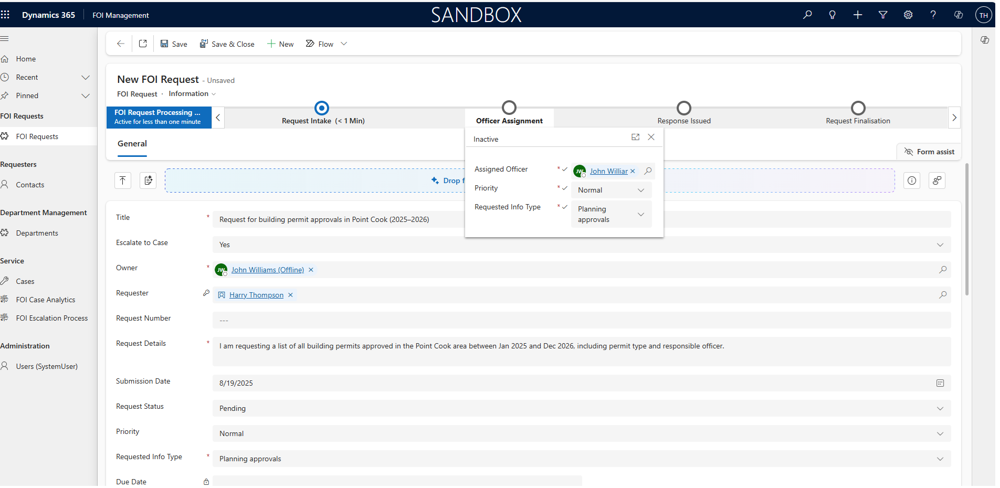
*Officers log requests with requester, due date, description and other fields.*

**FOI Request Detail View**
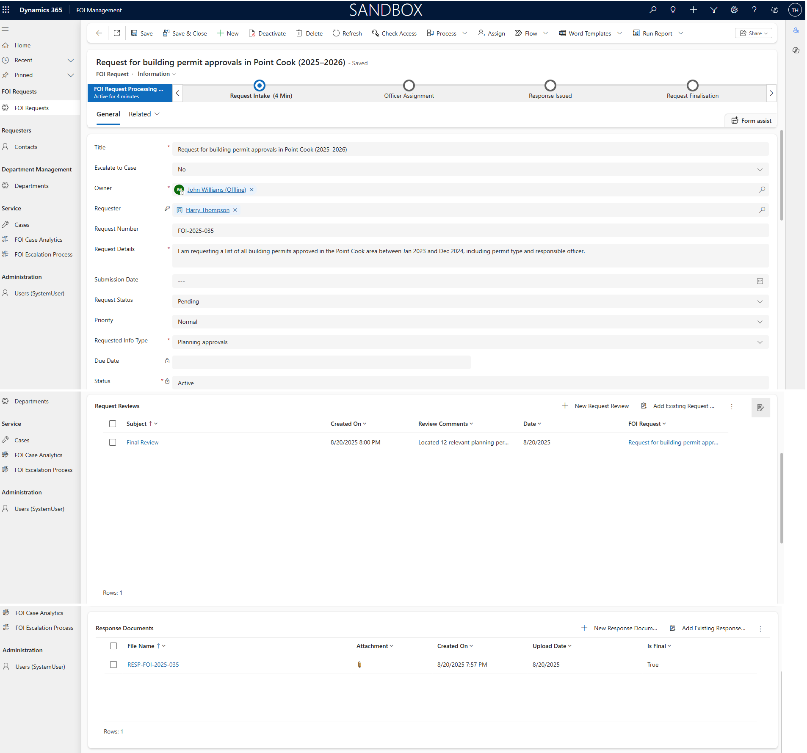
*Track request status, linked reviews and documents.*

**Model-Driven App – Escalation Case (linked to FOI Request)**
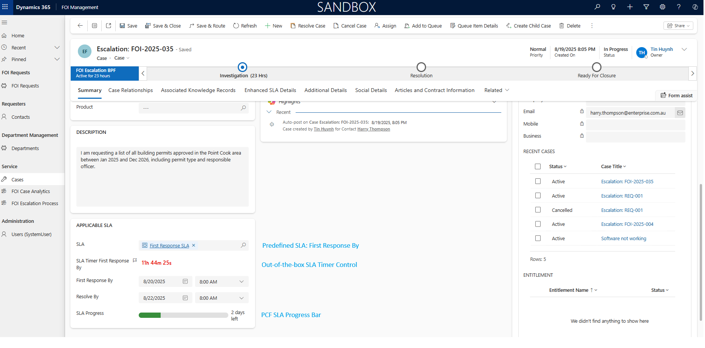
*Displays escalation-related Case record generated from FOI Request, showing BPF stage, PCF SLA Progress Bar, and SLA Timer.*

**Canvas App – Search & Upload | Search Screen | Upload Screen |**
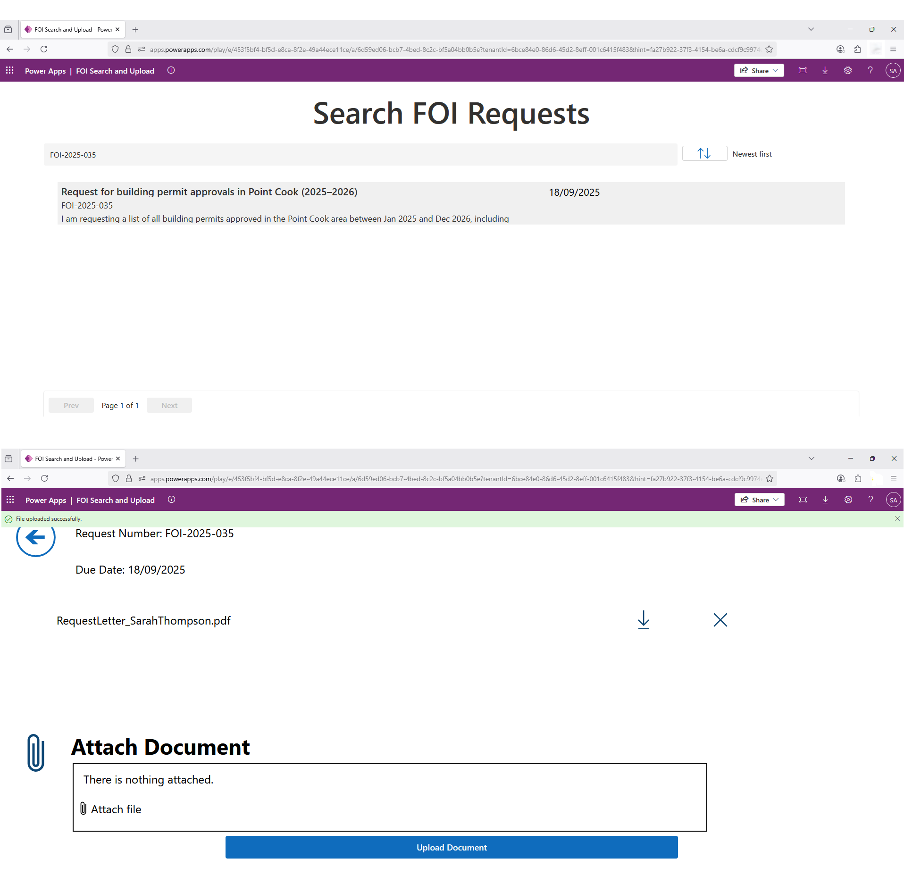
*Responsive layout with request search results and upload interface showing immediate success feedback.*

**SharePoint Integration**
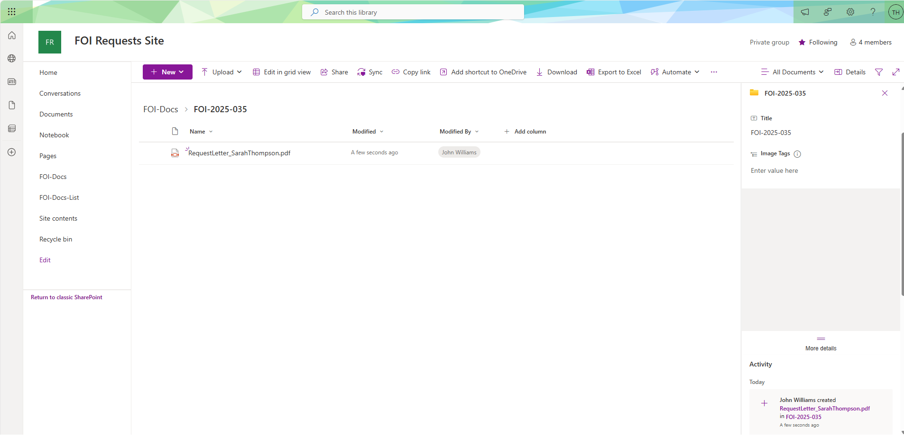
*Folder automatically created by Power Automate when a new FOI Request is submitted, matching the FOI Request Number in Dataverse.*

**Power Pages – Request Details (Liquid + FetchXML)**
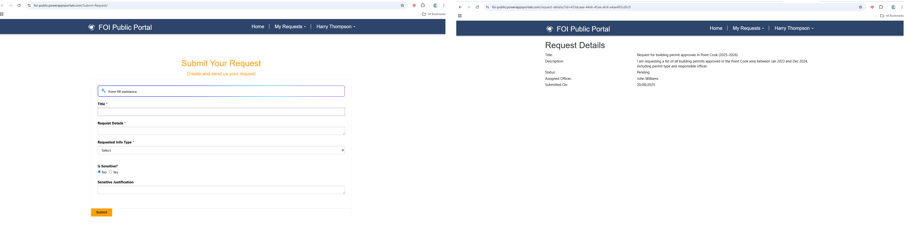
*Displays request form submission page using basic form and details page with related officer information using Liquid templates and FetchXML.*

**Power BI – FOI Case Analytics Dashboard**
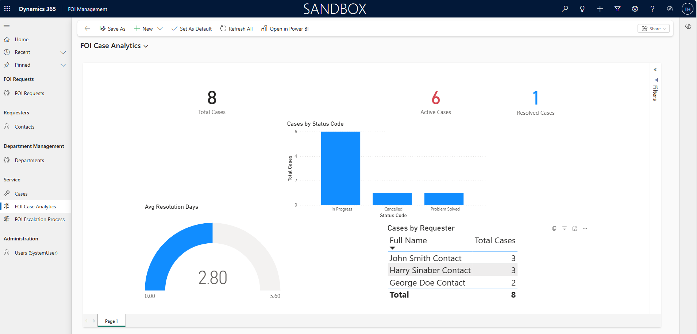

### **Technical Appendix**

**Dataverse Schema**
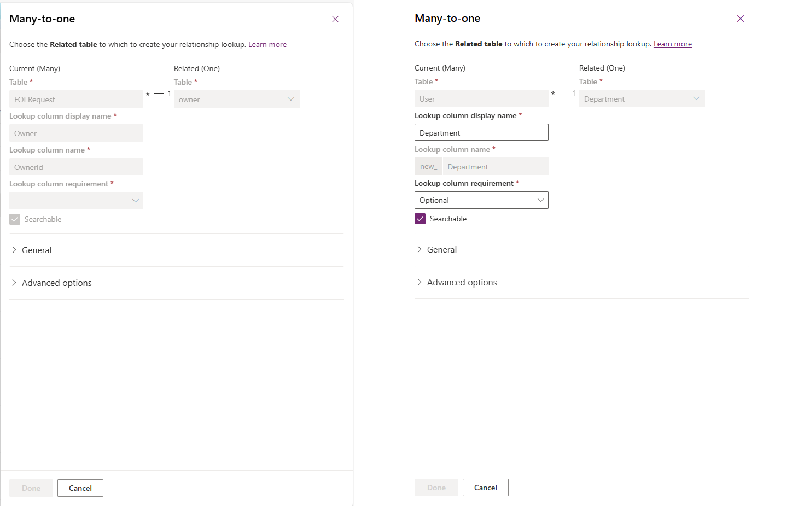
*FOI Request uses Owner (User) as the Assigned Officer. Each User links to a Department, so department access is inherited via the officer rather than a direct Request→Department link.*

**FOI Flow Overview & FOI Flow Run History**
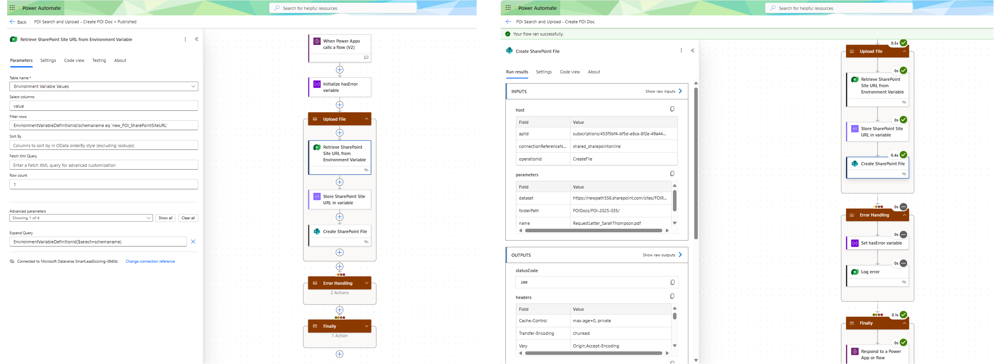
*Retrieves SharePoint Site URL from an Environment Variable (queried by Schema Name for ALM portability), implements Try–Catch–Finally for error handling, and returns a success/failure status back to the Canvas app. Screenshot shows the environment variable step and a successful run history.*

**Role-based Security**

*Custom security roles (FOI Admin, FOI Team Leader, FOI Officer and FOI Auditor) configured to control access at record level. Admins have full Organisation-wide CRUD access, Team Leaders can view FOI Requests in their respective Business Unit, Officers have create/read/write access for their own FOI Requests, and Auditors have Organisation-wide Read access.*

**Hierarchy Security**
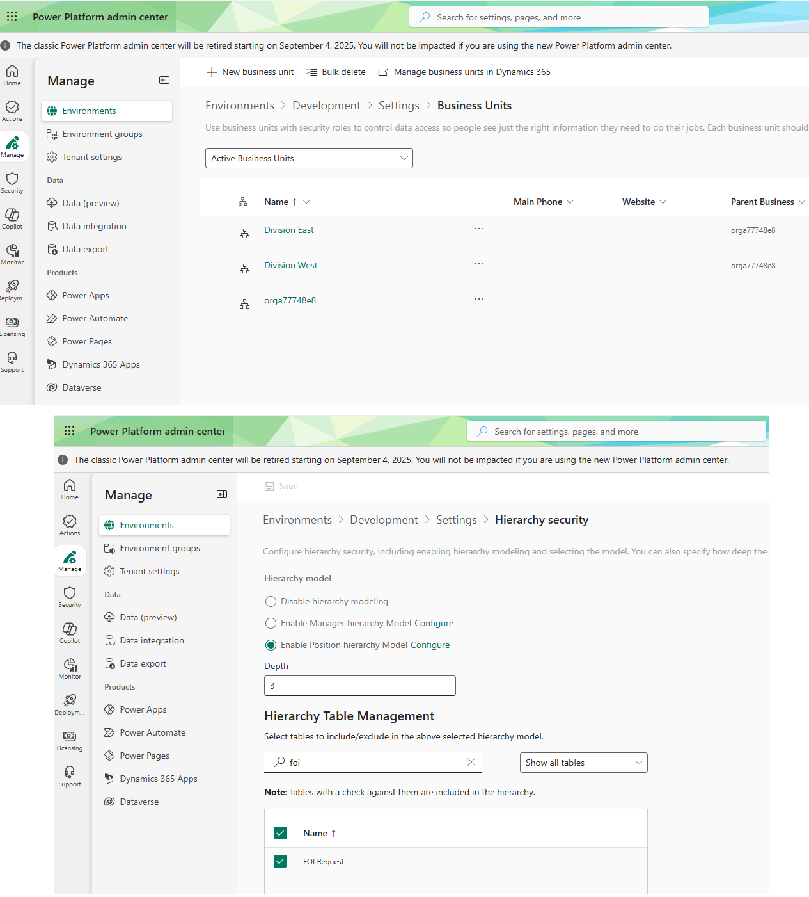
*Business Unit hierarchy configured to reflect government divisions. Managers and Officers in child BUs only see records from their own division, while Managers and Auditors in the root BU have broader access.*

**Plugin Automation**
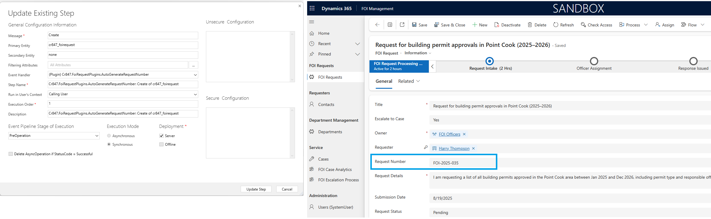
*C# Plugin for FOI Reference Number – Custom plugin registered on the Create message of FOI Request. When a new request is saved, the plugin generates a unique reference number (e.g., FOI-2025-035) to enforce consistent record-keeping.*

---

## My Role & Contribution

### Architecture & Design
- Designed the overall solution architecture across Model-Driven App, Canvas App, and Power Pages.
- Defined the Dataverse schema, relationships, and supporting enterprise entities (Audit, Integration Log, ETL Staging).
- Produced system diagrams (C4 model, DFDs, ERDs) for maintainability and onboarding.
- Designed the full enterprise integration landscape including asynchronous pipelines, ETL migration, observability, error logging, and routing rules.

---

### Development & Customisation
- Implemented Model-Driven, Canvas, and Power Pages apps with responsive UI and advanced customisation.
- Built PCF control, C# plugins, client-side JavaScript, and Business Process Flows.
- Configured SharePoint integration and document automation pipelines.
- Created automated workflows, environment variables, and connection references.
- Implemented custom security roles, hierarchy security, table permissions, and Power Pages web roles.
- Created dashboards, charts, SLA visualisation, and Power BI integration.

---

### Enterprise Engineering & DevOps
- Implemented governance measures such as DLP policies, Solution Checker, and environment configuration standards.
- Built structured error logging, integration diagnostics, and reliability monitoring.
- Developed Power Automate flows with try–catch patterns and integration with Integration Log + audit tables.
- Set up CI/CD pipelines using Power Platform Pipelines and Azure DevOps for deployment across DEV and TEST.
- Designed, built, and executed ETL migration pipelines, staging validation, and run summaries.
- Wrote xUnit + FakeXrmEasy unit tests to validate plugin logic and core business rules.
- Delivered enterprise-level operational readiness across ALM, data migration, integration reliability, observability, routing rules, and automated testing.

This FOI Management Suite delivers full end-to-end capability across intake, case management, document handling, integrations, compliance, auditing, DevOps, and operational support. It reflects real public-sector requirements while remaining modular, maintainable, and scalable for long-term use. All components are designed for low-risk deployment, operational stability, and supportability by government teams.
