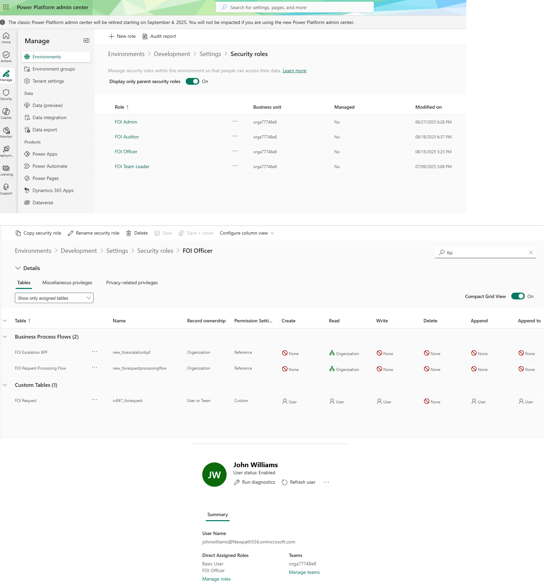

**This README provides an overview, screenshots, design documentation, and source code folder structure. Please contact me if you are interested in full technical solution and source code. Thank you.**

## **FOI Management Suite**
*A Freedom of Information (FOI) request handling solution featuring Model-Driven and Canvas Apps, plus a Self-Service Power Pages portal.*

### **Overview**
The FOI Management Suite is an end-to-end solution built on Microsoft Power Platform and Dynamics 365 Customer Service, designed to streamline Freedom of Information (FOI) request processing for government or public sector organisations.
It integrates internal case management tools with a secure citizen-facing portal, enabling efficient request intake, document handling, SLA monitoring, and compliance tracking.

**Impact:** Reduced FOI request processing time by an estimated 40% through automated workflows, integrated self-service submission, and centralised case management.

---

### **Key Components**

1. **FOI Management – Model-Driven App**
   - Built on the **D365 Customer Service Case entity** for end-to-end request tracking.
   - Business Process Flow to guide FOI officers through request lifecycle.
   - SLA Alerts & out-of-the-box (OOB) SLA Timer control for compliance monitoring.
   - Custom PCF SLA Progress Bar for enhanced SLA visualisation.
   - Client-side JavaScript to enforce uppercase Department codes and warn if not exactly three characters.
   - C# Plugin for automated case number generation and server-side logic.
   - Utilises Dataverse FOI Escalation BPF’s View, Chart, and Dashboard for Power BI integration.

2. **FOI Search & Upload – Canvas App**
   - Responsive layout supporting mobile and desktop devices.
   - Secure request search and document upload interface for internal staff.
   - SharePoint integration for document storage; Dataverse for metadata.
   - Immediate success/error feedback on uploads, with error logging built into relevant flows.

3. **Self-Service Citizen Portal – Power Pages**
   - Public-facing site for submitting FOI requests online and tracking status.
   - Request Details page using Liquid templates and FetchXML to display related data (e.g., assigned officer).
   - Page permissions for secure content access.
   - Role-based access and table permissions for secure citizen interactions.
   - Sign Up, Sign In, and OOB Profile management features enabled.
   - Request Submission form implemented as OOB Basic Form.

---

### **Key Features**
- **Automation:** Power Automate flows for FOI request assignment, folder creation, and document routing from Dataverse to SharePoint.
- **Security:** Role-based security, field-level security, hierarchy security (position model), DLP policies, and page permissions in Power Pages.
- **Integration:** SharePoint Online for document management.
- **Governance:** Environment variables for configuration, DLP enforcement, use of Solution Checker, and deployment across DEV and Test environments via Power Platform Pipelines.
- **Error Handling:** Error handling and logging logic built into relevant flows (Record ID, Source Flow, Error Message, Timestamp).
- **Notifications:** Stakeholder and requester notifications built into relevant flows.
- **Reporting:**
  - **FOI Case Analytics** – Overview of FOI activity including total cases, active vs. resolved counts, case distribution by status code, average resolution time, and requester breakdown.
  - **FOI Escalation Process** – Visualises case volumes at each Business Process Flow stage (Investigation, Resolution, Ready for Closure) alongside status reasons (Active, Finished, Aborted).

---

### **Automation Overview**
- FOI request assignment and SLA monitoring workflows.
- Document upload to Dataverse, then routed to SharePoint with metadata updates.
- Automated folder creation linked to FOI Request Numbers.

Full list of flows, triggers, connectors, and purposes is documented in
[`/docs/automation-details.md`](./docs/automation-details.md).
For a visual representation to some of the flows, see the Data Flow Diagrams (DFD) in the `/docs` folder.

---

### **Technical Highlights**
- **D365 Customer Service Case entity** customisation.
- **Business Process Flows** for structured case progression, including FOI Escalation BPF.
- **Custom PCF SLA Progress Bar control** for SLA visualisation.
- **Client-side JavaScript** for validation and formatting.
- **C# Plugin** for server-side automation.
- **Business Rules** for validation and automation.
- **Custom Action in Power Automate** to resolve cases from within the flow.
- **FetchXML** in both Power Automate and Power Pages Liquid templates.
- **Responsive Canvas App** design for mobile and desktop.
- **Liquid templates** for customised portal experiences.
- **Power BI**: Built with Power BI Desktop, including integration with Dataverse BPF views, charts, and dashboards.

---

### **Tech Stack**
- **Microsoft Power Platform:** Model-Driven App, Canvas App, Power Pages, Power Automate
- **Microsoft Dataverse** – Core data platform
- **Dynamics 365 Customer Service** – Case management foundation
- **SharePoint Online** – Document storage and metadata
- **Power BI Desktop & Service** – Reporting and dashboards
- **PCF, C#, JavaScript, FetchXML, Liquid** – Customisation & development

---

### **Architecture & Diagrams**
The solution follows a layered architecture:
- **Presentation Layer:** Model-Driven App, Canvas App, Power Pages
- **Business Logic Layer:** Power Automate workflows, business rules, C# plugins, PCF control
- **Data Layer:** Dataverse tables for requests, documents, SLA tracking, and logs

*Refer to attached diagrams in `/docs` for:*
- `c4-architecture-foi.png` – System Architecture Diagram (C4 Container)
- `dfd-foi-canvas-upload-delete.png` – Data Flow Diagram: Canvas Upload and Delete
- `dfd-foi-md-crud-assign-team.png` – Data Flow Diagram: FOI Request's Team Assignment
- `erd-foi-management-suite.png` – Entity Relationship Diagram

---

### **Screenshots**

#### **Solution Overview**

**Submit New FOI Request (Business flow)**

*Officers log requests with requester, due date, description and other fields.*

**FOI Request Detail View**

*Track request status, linked reviews and documents.*

**Model-Driven App – FOI Case Form**

*Business Process Flow at active stage, PCF SLA Progress Bar, OOB SLA Timer, and key FOI fields populated.*

**Canvas App – Search & Upload**
| Search Screen | Upload Screen |

*Responsive layout with request search results and upload interface showing immediate success feedback.*

**SharePoint Integration**

*Folder automatically created by Power Automate when a new FOI Request is submitted, matching the FOI Request Number in Dataverse.*

**Power Pages – Request Details (Liquid + FetchXML)**

*Displays request form submission page using basic form and details page with related officer information using Liquid templates and FetchXML.*

**Power BI – FOI Case Analytics Dashboard**

#### **Technical Appendix**

**Dataverse Schema**

*FOI Request uses Owner (User) as the Assigned Officer. Each User links to a Department, so department access is inherited via the officer rather than a direct Request→Department link.*

**FOI_Flow_Overview.png & FOI_Flow_RunHistory.png**

*Retrieves SharePoint Site URL from an Environment Variable (queried by Schema Name for ALM portability), implements Try–Catch–Finally for error handling, and returns a success/failure status back to the Canvas app. Screenshot shows the environment variable step and a successful run history.*

**Role-based Security**

*Custom security roles (FOI Admin, FOI Team Leader, FOI Officer and FOI Auditor) configured to control access at record level. Admins have full Organisation-wide CRUD access, Team Leaders can view FOI Requests in their respective Business Unit, Officers have create/read/write access for their own FOI Requests, and Auditors have Organisation-wide Read access.*

**Hierarchy Security**

*Business Unit hierarchy configured to reflect government divisions. Managers and Officers in child BUs only see records from their own division, while Managers and Auditors in the root BU have broader access.*

**Plugin Automation**

*C# Plugin for FOI Reference Number – Custom plugin registered on the Create message of FOI Request. When a new request is saved, the plugin generates a unique reference number (e.g., FOI-2025-035) to enforce consistent record-keeping.*

---

### **My Role & Contribution**
- Designed the architecture and implemented all solution components.
- Developed Model-Driven, Canvas, and Power Pages apps with responsive UI and advanced customisation.
- Built and configured PCF control, C# plugins, and client-side JavaScript.
- Set up governance measures including DLP, environment variables, and Solution Checker.
- Power Platform Pipelines deployments across DEV and TEST environments.
- Created and documented automated workflows, security models, and integration points.
- Produced solution diagrams and technical documentation for maintainability.
