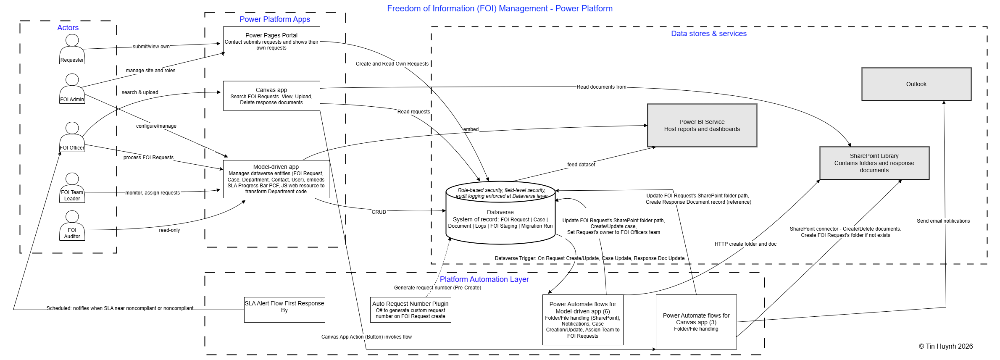
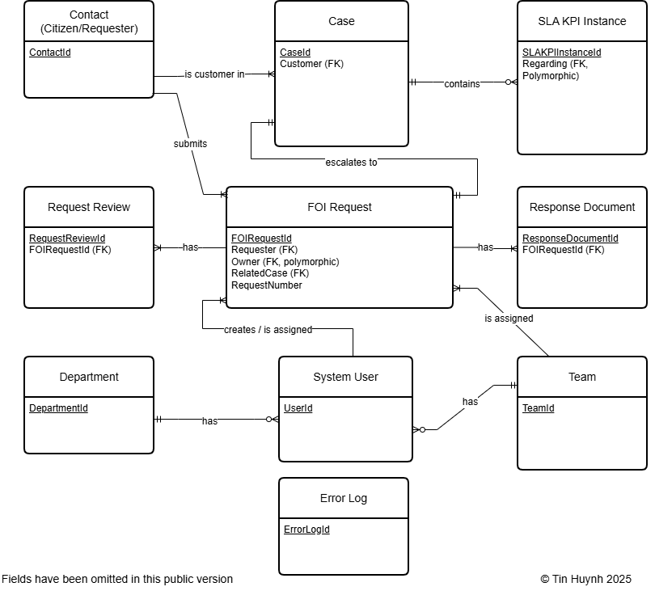
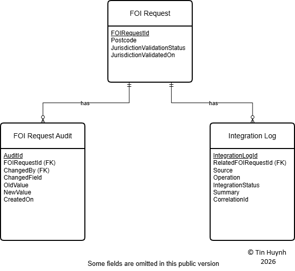
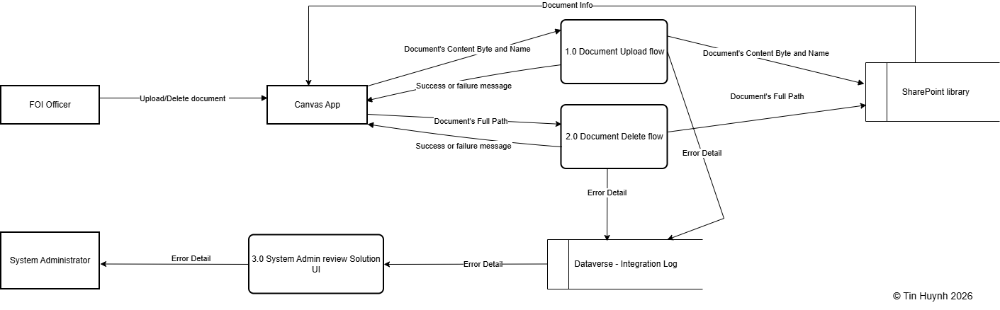

# FOI Management Suite – Architecture Overview
This page provides a consolidated view of all key architecture diagrams for the FOI Management Suite, including system context, data modelling, dataflows, integrations, ETL staging, observability, and DevOps pipelines.  
Each diagram is clickable to view full resolution.

---

## 🟦 C4 System Context – High-Level Architecture

High-level FOI system context showing how user roles interact with Power Pages, Canvas App, and Model-Driven App, and how these applications connect with Dataverse, SharePoint, Power Automate flows, Outlook notifications, and Power BI dashboards.

Additional enterprise integrations such as Azure Function validation, Service Bus events, Logic Apps ingestion, and ETL staging are represented in separate diagrams and extend this high-level system view.

---

## 🟩 Core Dataverse ERD – FOI Management Suite

Entity-relationship diagram showing the core Dataverse tables used in the FOI Management Suite. It includes FOI Request linked to Contact (Requester), Case (escalation path), Request Review, Response Document, Department, Team, System User, and SLA KPI Instance. It also shows an Error Log table used for recording integration or processing issues.

Additional data models such as ETL staging tables and the Audit/Integration Log schema are documented separately to keep the core operational ERD focused and readable.

---

## 🟥 Audit & Integration Observability ERD

ERD showing how FOI Request records are linked to two supporting tables: FOI Request Audit and Integration Log. FOI Request Audit stores field-level changes (old/new values, changed by, timestamp), while Integration Log stores outcomes of external or automated processing steps, including source system, operation, status, summary, and correlation ID.

This model separates business-level audit history from system-level integration observability, allowing clearer diagnostics and traceability across automated processes.

---

## 🟥 Data Migration & Import ERD

ERD showing the staging and data migration structure for FOI Request imports. “Data Migration Run” records each batch with timing, counts, and status. Each run produces multiple “FOI Request Import” records containing source metadata, processing status, error messages, and correlation IDs. Imported records may include associated attachments stored in “FOI Request Attachment.” Valid imports are promoted into the main “FOI Request” table.

---

## 🟪 Azure Function Validation + Service Bus Event Flow

Integration flow showing how an FOI Request creation triggers an async Dataverse webhook, processed by an Azure Function that validates jurisdiction, updates Dataverse, writes an Integration Log, and publishes an event to a Service Bus queue. A Logic App consumes the queued event using peek-lock, writes downstream integration logs, and sends failed messages to a dead-letter queue for retry or inspection.

---

## 🟫 Logic Apps Integration – Email Intake Processing

Email ingestion flow showing how the FOI mailbox triggers an Azure Logic App that creates FOI Request Import records and associated Request Attachments in Dataverse. Files are stored in SharePoint, and any processing failures are logged to the Integration Log for diagnostics.

---

## 🟫 ETL Staging → FOI Request Promotion Process

ETL staging pipeline demonstrating dataflow ingestion, transformation rules, validation, and controlled promotion of records into the FOI Request table for operational use.

---

## 🟧 DFD – Model-Driven CRUD & Assignment Logic

Flow diagram showing how FOI Requests are created and managed through Power Pages and the Model-Driven App. Requesters submit or view requests via Power Pages, while FOI Officers perform CRUD operations in the Model-Driven App. All interactions write to Dataverse, which triggers an automated flow to assign the FOI Officers team to new requests. Both apps read Dataverse data for display and updates.

---

## 🟨 DFD – Canvas Document Upload & Delete Flow

The Canvas App triggers multiple Power Automate flows to handle document operations. Two flows write diagnostic details to the Integration Log, and one writes to the Error Log for exceptions. The diagram shows the high-level pattern only; individual flow variations are intentionally omitted for clarity.

---

## 🔵 DevOps / ALM Pipeline Overview

DevOps/ALM pipeline showing how the unmanaged solution from the DEV environment is exported into an Azure DevOps build pipeline, published as build artifacts, and deployed via a release pipeline into the TEST environment as a managed solution.

---

## 🔗 Full Diagram Directory
For all original PNG files and updates, see:  
`/docs/diagrams/`