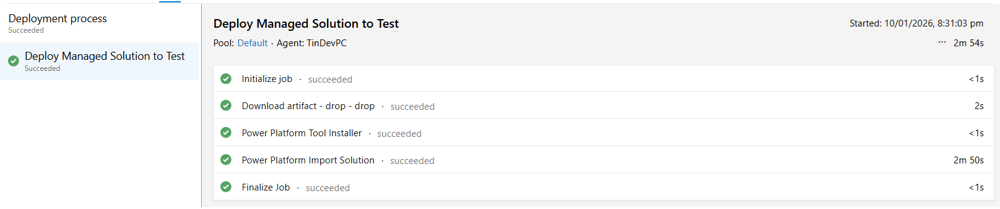
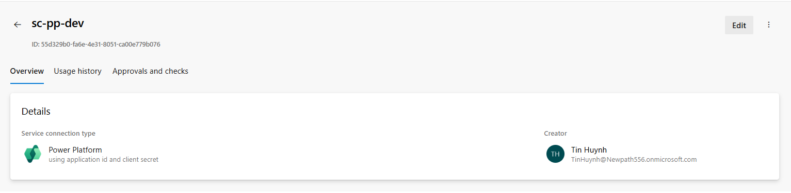
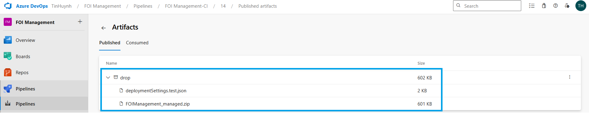

# ALM & DevOps Discipline — Azure DevOps CI/CD (Dev → Test)

This project implements a controlled ALM process using Azure DevOps for exporting managed solutions from DEV and deploying them into TEST with environment-specific configuration. The goal is to demonstrate enterprise-grade governance, repeatability, and reliable solution promotion.

---

## Architecture Overview


---

## Build Pipeline (CI)

The CI pipeline performs:

- Export of **managed** solution from DEV  
- Version stamping for controlled releases  
- Automatic generation of `deploymentSettings.json`  
- Packaging artifacts into the `drop` folder  
- Publishing artifacts via Power Platform Build Tools  

**Build output structure:**

```
drop/
 ├── FOI_Management_Managed.zip
 └── deploymentSettings.json
```

---

## Release Pipeline (CD)

The CD pipeline:

- Retrieves the `drop` artifact  
- Authenticates using a service principal  
- Imports the managed solution into TEST  
- Applies environment variables  
- Applies connection references  
- Logs all deployment operations for auditing  

---

## Rollback Strategy

Rollback is handled through controlled redeployment of the **last known good managed solution** via Azure DevOps.

In the event of a failed or regressive release:
- The previous managed solution artifact is redeployed using the same CI/CD pipeline
- Environment variables and connection references are reapplied from versioned deployment settings
- No direct production edits or hotfixes are performed outside ALM

This ensures predictable recovery, auditability, and alignment with enterprise change control practices.

---

## Environment Strategy

| Environment | Purpose | Customisations |
|------------|---------|----------------|
| **DEV**    | Development & experimentation | Unmanaged |
| **TEST**   | QA, validation, stakeholder review | Managed only |
| **PROD** *(future)* | Production | Managed only |

TEST is locked down as a managed-only environment to ensure deployment consistency and prevent accidental changes.

---

## Deployment Settings (Environment Separation)

Example structure:

```json
{
  "EnvironmentVariables": [
    {
      "SchemaName": "new_EnvironmentSpecificVariable",
        "Value": "https://test.sharepoint.com/sites/foi",
        "DefaultValue": "https://test.sharepoint.com/sites/foi",
        "Name": {
          "Default": "FOI_SharePointSiteURL",
          "ByLcid": {
            "1033": "FOI_SharePointSiteURL"
          }
        },
        "TypeId": 100000000,
        "IsRequired": false
    }
  ],
  "ConnectionReferences": [
    {
      "LogicalName": "shared_sharepointonline_connection",
      "ConnectionId": "<TEST-CONNECTION-ID>",
      "ConnectorId": "/providers/Microsoft.PowerApps/apis/shared_sharepointonline"
    }
  ]
}
```

This enables environment-specific configuration without modifying the solution.

---

## Security & Governance Controls

- Service principal authentication  
- Least-privilege access model  
- Deployments into TEST are restricted to CI/CD pipelines, ensuring controlled promotion and traceability

---

## Change-Controlled Components

Certain components are intentionally excluded from routine solution deployments.

These components are operationally sensitive and are updated only when a change is required:

- Webhook registrations (bound to environment-specific Azure Function endpoints)
- Email intake Logic Apps (mailbox- and tenant-bound)
- Service Bus publishers and downstream Logic Apps (disabled in Test to isolate external dependencies)
- Routing Rule Sets (active rules are not overwritten to avoid deployment failures or unintended production impact)

This mirrors enterprise deployment practices where infrastructure-bound and operational components are managed separately from application solution releases.

---

## Screenshots


*Build Pipeline (DEV) - CI run completed with managed solution export and artifact packaging.*
<br><br>


*Release Pipeline (TEST) - Managed solution imported successfully via CD.*
<br><br>


*Secure service principal used by Azure DevOps to access the DEV environment.*
<br><br>


*Managed solution and deployment settings packaged for release.*