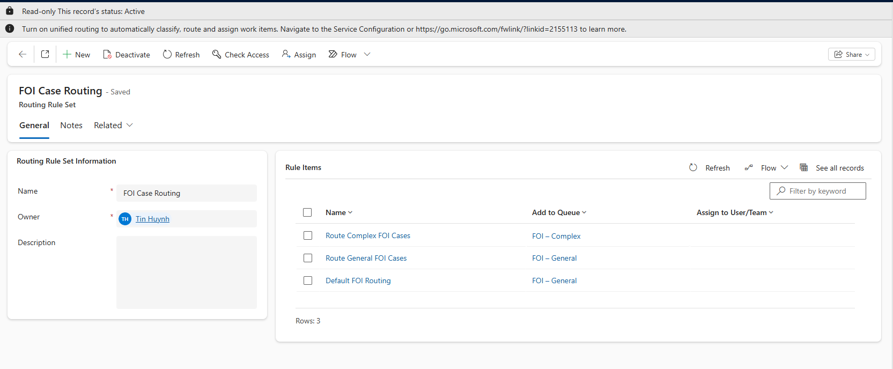
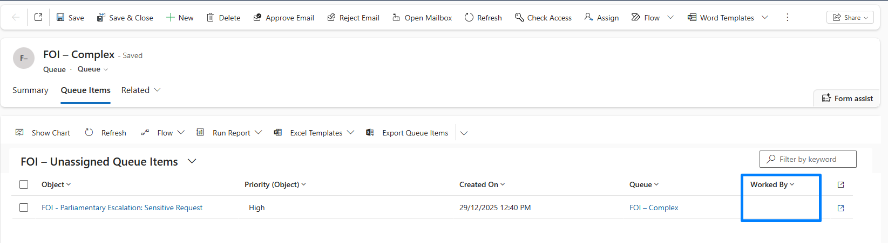
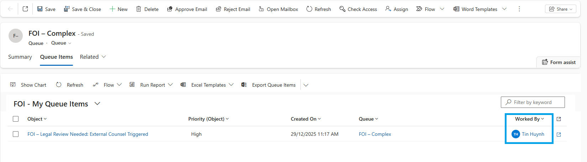

# Queue-Based Case Assignment (Routing Rules)

## Overview
This feature implements **native Dynamics 365 queue-based routing** to automatically triage new FOI Cases into the appropriate queues based on **Priority**. This supports structured workload distribution, visibility, and BAU operational workflows commonly used in government-style service environments.

---

## Configuration Summary

### **Queues Created**
- **FOI – General**
- **FOI – Complex**

Both configured:
- According to organisation’s access policies
- Containing relevant FOI team users

---

### **Routing Rule Set**

A Routing Rule Set was created for the **Case (incident)** table consisting of three rules:

| Rule Order | Condition | Action |
|-----------|-----------|--------|
| 1 | Priority = High | Route to **FOI – Complex** queue |
| 2 | Priority = Normal OR Low | Route to **FOI – General** queue |
| 3 | Case contains data (fallback) | Route to **FOI – General** queue |

The fallback rule ensures **no case remains unrouted**, even when priority is missing.

Routing Rule Set is set to **Active**, and only one rule set exists for Cases.

---

### **Queue Item Views**

Two operational views were configured for Queue Item:

#### **1. FOI – Unassigned Queue Items**
Shows items where **Worked By** is empty (triage backlog).

#### **2. FOI – My Queue Items**
Shows items where **Worked By** equals the current user (claimed items).

These views support:
- Unassigned workload visibility
- Work ownership transparency
- Supervisor monitoring

---

## Operational Workflow

1. A new Case is created and saved.
2. Routing Rule Set evaluates Priority:
   - **High** → FOI – Complex
   - **Normal / Low / Missing** → FOI – General
3. Case appears as a **Queue Item** in the correct queue.
4. Officers open the queue and view:
   - *Unassigned Queue Items*
   - *My Queue Items*
5. Officer selects a queue item and clicks **Pick**:
   - Case Owner becomes the user
   - Queue retains visibility for supervisors

This workflow reflects standard service management patterns used in enterprise and government teams.

---

## Screenshots

*Priority-based routing: High → FOI – Complex, Normal/Low → FOI – General, with fallback rule ensuring no case is unrouted.*

*Unassigned Queue Items view showing new FOI Cases awaiting triage (Worked By is empty).*

*Queue item picked by the officer - Worked By set to current user while queue visibility is retained for supervisors.*