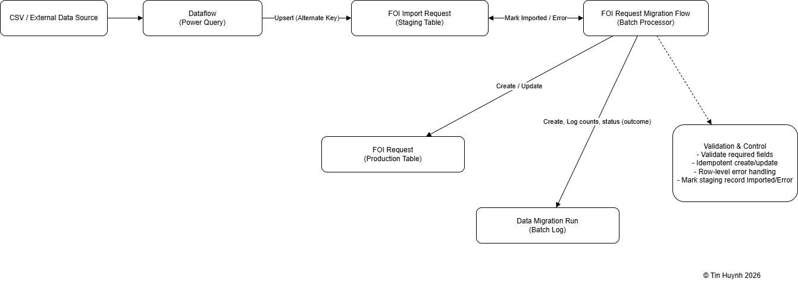
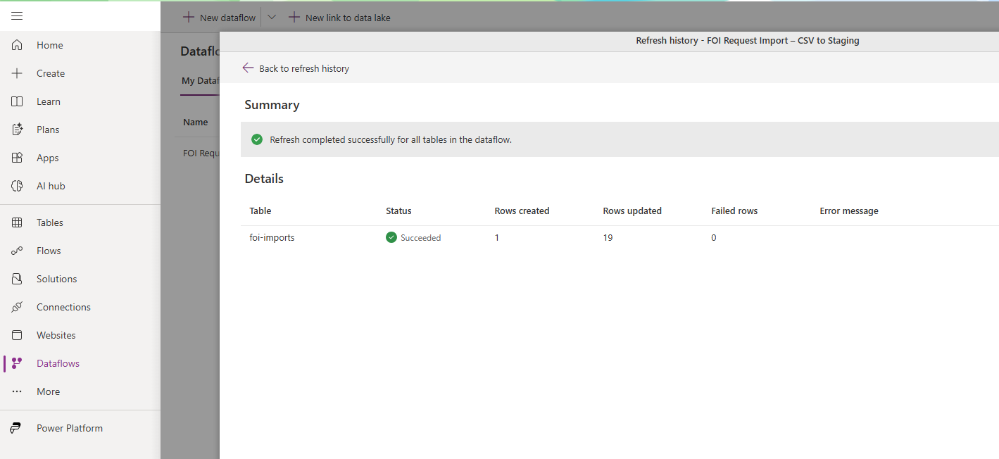
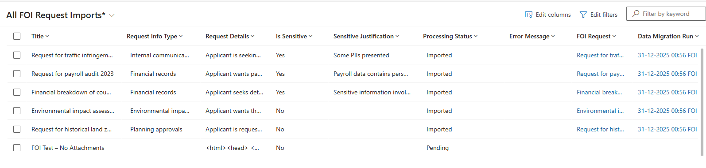
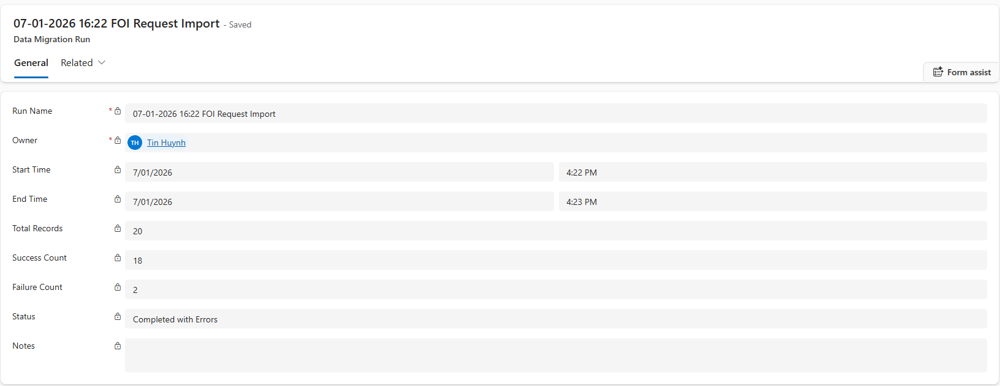
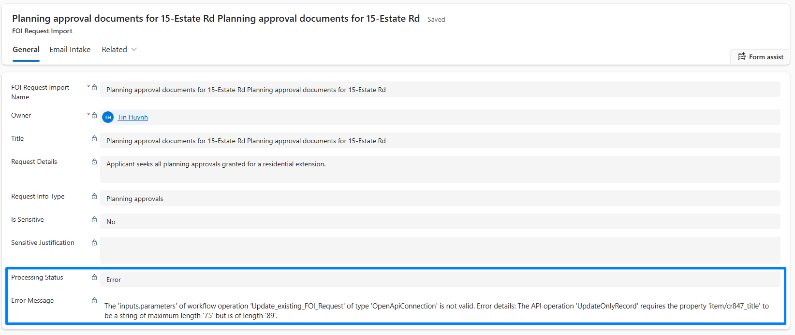

# ETL and Data Migration (Staging to FOI Request)

## Problem
Operational systems often need to migrate or ingest data from legacy sources without risking data corruption or production instability.

This creates challenges such as:
- Risk of duplicate or inconsistent records
- Lack of visibility into migration success or failure
- Difficulty rerunning migrations safely
- Poor auditability of historical loads
- High operational risk when loading data directly into production tables

---

## What I Built
A controlled **ETL + data migration pipeline** using a staging pattern.

This includes:
- A **FOI Import Request** staging table to receive external data
- A **Data Migration Run** table to track batch execution, counts, and outcomes
- A **Dataflow (Power Query)** to load and transform CSV data into staging
- A **migration flow** that validates, creates, or updates FOI Request records
- Status and error tracking at the **row level**

This design ensures production FOI Requests are only created or updated after validation and controlled processing.

---

## How It Works (High Level)

- Data is loaded into the **FOI Import Request** staging table (**Pending** status) via a **Dataflow**
- Each migration run creates a **Data Migration Run (batch level)** record for traceability
- The migration flow processes staging records in a controlled batch:
  - Applies business validation rules before committing data
  - Creates or updates FOI Requests repeatability and safely without duplication
  - Marks each staging record' status as **Imported** or **Error**
- Execution outcomes (success/partial success/failure) are recorded in **Data Migration Run** record
- Errors are captured per record without stopping the entire batch
- The migration can be safely re-run without creating duplicates

Support teams can clearly see:
- What ran
- When it ran
- How many records succeeded or failed
- Which records require correction

---

## Why This Matters
- **Reliability** - Production data is protected behind a staging layer
- **Auditability** - Every migration run is tracked with counts and outcomes
- **Supportability** - Failed records are isolated and recoverable
- **Governance** - Clear separation between external data and core entities
- **Scalability** - Pattern supports future sources (CSV, SQL, integrations)

---

## Screenshots

*Dataflow run showing staging table ingestion.*
  

*FOI Import Request staging table populated with mapped fields.*
  

*Data Migration Run execution record with batch status and counts.*
  

*Staging record showing Processing Status = Error and captured validation message.*
