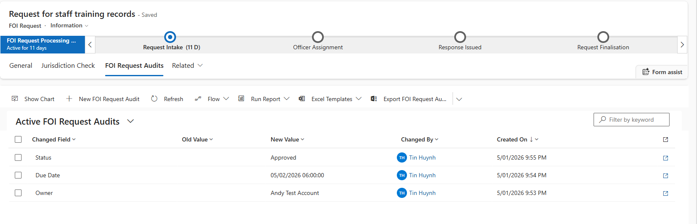
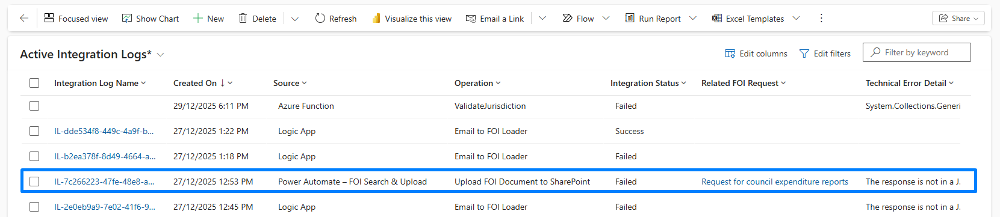

# Compliance, Governance & Auditing

## Problem
FOI and other regulated case management systems require:
- Clear accountability (who did what, when)
- Trustworthy audit trails
- Visibility into integration failures
- Evidence suitable for audits, investigations, and support teams

While Dataverse provides native auditing, it is:
- Technical and not business-friendly
- Not surfaced clearly inside the application
- Not ideal for operational reporting

Integration failures are also often hidden in Power Automate run history or email notifications, which limits transparency and supportability.

---

## What I Built
I implemented a **layered governance approach** covering both **business auditing** and **technical integration logging**.

### FOI Request Business Audit

A business-readable audit trail embedded directly in the FOI application.

**Key points**
- Custom **FOI Request Audit** Dataverse table
- Automatically records key lifecycle changes:
  - Status
  - Owner
  - Due date
  - Classification
- Each entry captures:
  - Changed field
  - New value
  - Changed by
  - Changed on (Timestamp)
  - Related FOI Request

**Usage**
- Displayed as a **read-only subgrid** on the FOI Request form
- Easily readable by FOI officers and managers
- Filterable and reportable
- Complements Dataverse native audit (forensic) with business transparency

---

### Integration Logging

A structured logging capability for SharePoint and other external integrations.

**Integration Log**
- Dedicated Dataverse table capturing:
  - Source
  - Operation
  - Integration Status (Success / Failed)
  - Related FOI Request
  - Outcome Summary
  - Technical Error Detail
  - Timestamp
  - Correlation Id

**Implementation**
- Integration components automatically write structured log entries whenever an operation fails or encounters an exception.
- Logging is implemented consistently across multiple integration points, including:
  - **Power Automate flows responsible for FOI document and SharePoint folder creation**
  - **The Jurisdiction Validation Azure Function**
  - **Azure Logic Apps used for email ingestion and downstream processing of Service Bus events**
- The pattern is reusable and can be extended to future integrations without redesigning core components.

**UX & Governance**
- Integration Log exposed in FOI Model-Driven App
- Read-only views and forms
- System-generated records (owned by development account in this portfolio, and would use an integration user in production)

---

## Why This Matters
- **Accountability**: clear, readable audit history inside the app
- **Compliance**: supports audits, reviews, and investigations
- **Supportability**: integration issues visible without Power Automate access
- **Enterprise readiness**: solution-managed, immutable, extensible design

---

## Screenshots

*FOI Request Audit - business-readable lifecycle history of key FOI request changes.*
  

*Integration Log - centralised logging of integration failures and operational diagnostics.*
