# Integration Readiness & Asynchronous Processing

## Problem
FOI and enterprise case management systems rarely operate in isolation. They must integrate with external systems to:
- accept inbound requests from multiple channels
- validate data asynchronously
- manage documents outside Dataverse
- avoid blocking core case processing
- remain observable and supportable when failures occur

Synchronous or tightly coupled integrations increase risk, reduce reliability, and make failures difficult to diagnose.

---

## What I Built
I implemented a **reusable, asynchronous integration capability** designed to support multiple FOI scenarios without blocking the core application.

The integration approach includes:
- Event-driven triggers (email intake, webhooks, app-initiated actions)
- **Azure Functions** to encapsulate integration and validation logic
- Asynchronous orchestration using **Logic Apps**
- Decoupling and downstream processing via **Service Bus**
- Integration with external systems such as **SharePoint**
- Centralised failure visibility via structured Integration Logs

This capability is applied consistently across different integration scenarios rather than being built as one-off flows.

---

## Where This Integration Pattern Is Used
The same integration principles are reused across multiple FOI use cases, including:

- **Email Ingestion Integration (Logic Apps)**  
  - Inbound FOI emails are processed asynchronously using Azure Logic Apps and staged as **FOI Request Import** records in Dataverse, capturing requester metadata and maintaining traceability via a Correlation ID.
  - Email attachments are uploaded to SharePoint under a structured folder hierarchy and linked back to Dataverse, with execution outcomes recorded in an Integration Log for traceability.
  - The inbound email ingestion and staging flow is documented in the *Email Ingestion Logic Apps Integration Flow Diagram* below.
  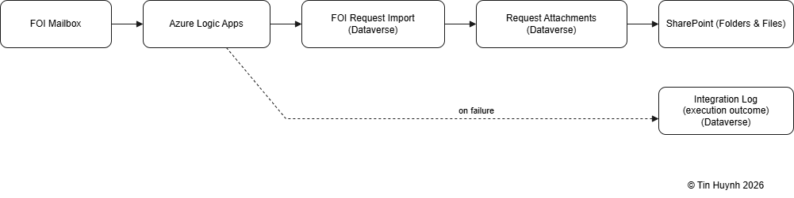

- **Jurisdiction validation**  
  - FOI Requests trigger an **asynchronous Dataverse webhook**, which invokes an **Azure Function** to perform jurisdiction checks (for example, validating whether a postcode falls within the supported jurisdiction).  
  - The Azure Function updates the FOI Request with the validation outcome and writes an **Integration Log** entry capturing the operation, status, correlation ID, and summary for traceability and operational support.  
  - When validation succeeds, the function publishes an `FOIValidated` event to a **Service Bus queue**, which is consumed by a **Logic App** for downstream processing (such as audit or notification simulation). A **second Integration Log** entry is written to confirm successful event consumption.  
  - Downstream processing is fully asynchronous and non-blocking. Messages that cannot be processed successfully are retried and, after reaching the configured **maximum delivery count (3 attempts)**, are moved to **dead-letter messages** in the queue, ensuring failures do not impact FOI request creation.
  - The jurisdiction validation flow is documented in the *Jurisdiction Validation (Webhook → Function → Service Bus → Logic App) Flow* diagram below.  
  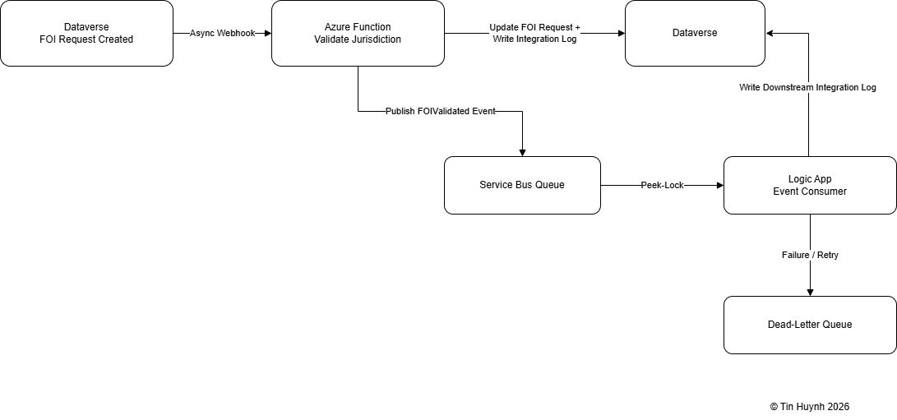

- **Document handling and storage**
  - Canvas app uploads directly to SharePoint
  - Scalable Document Storage: Response documents are offloaded from Dataverse to SharePoint via Power Automate, keeping Dataverse lightweight while maintaining metadata for traceability

These scenarios differ in business purpose but share the same integration design approach.

---

### Authentication & Security (Entra ID App Registration)

The **Azure Function** that validates jurisdiction authenticates to Dataverse using a dedicated **Entra ID App Registration** configured with:

- OAuth2 client credentials flow  
- A mapped Dataverse Application User  
- Least-privilege security role for FOI operations  
- Client ID and secret stored as application settings in the Function App (not hard-coded in code)

This ensures secure, service-to-service communication and aligns with enterprise security practices.

---

## How It Works (High Level)

The integration architecture follows a consistent, reusable pattern across all FOI workflows:

1. **Data enters through controlled ingestion points**  
   Sources include email intake, structured staging imports, or manual creation.

2. **A staging layer prepares and normalises the data**  
   Metadata and attachments are extracted, validated, and prepared before any downstream actions occur.

3. **Business rules trigger the required integrations**  
   Depending on the scenario, this may involve creating FOI records, running validations, generating attachments, or publishing internal events.

4. **Events are raised for downstream processing**  
   Key milestones such as “request created” or “successful validaton” publish internal events that other components can react to independently.

5. **Integration outcomes are recorded centrally**  
   Each integration step - success or failure - is logged with enough detail for support teams to understand what occurred without exposing internal logic.

6. **Support teams can trace and resolve issues quickly**  
   The consistent logging pattern allows support to see the last successful step, failure point, related FOI record, and whether retry is safe.

7. **The pattern is reusable across multiple scenarios**  
   The same architecture can be applied to additional integrations with minimal redesign.

This design ensures integrations remain asynchronous, resilient, and observable.

---

## Why This Matters
- **Reliability**: integrations fail safely without impacting FOI request creation
- **Decoupling**: business logic is isolated from orchestration and transport
- **Scalability**: event-driven processing supports higher volume and future scenarios
- **Observability**: failures are visible and diagnosable outside run history
- **Enterprise alignment**: mirrors real-world integration patterns used in regulated environments

---

## Screenshots

### Section A - Email Ingestion

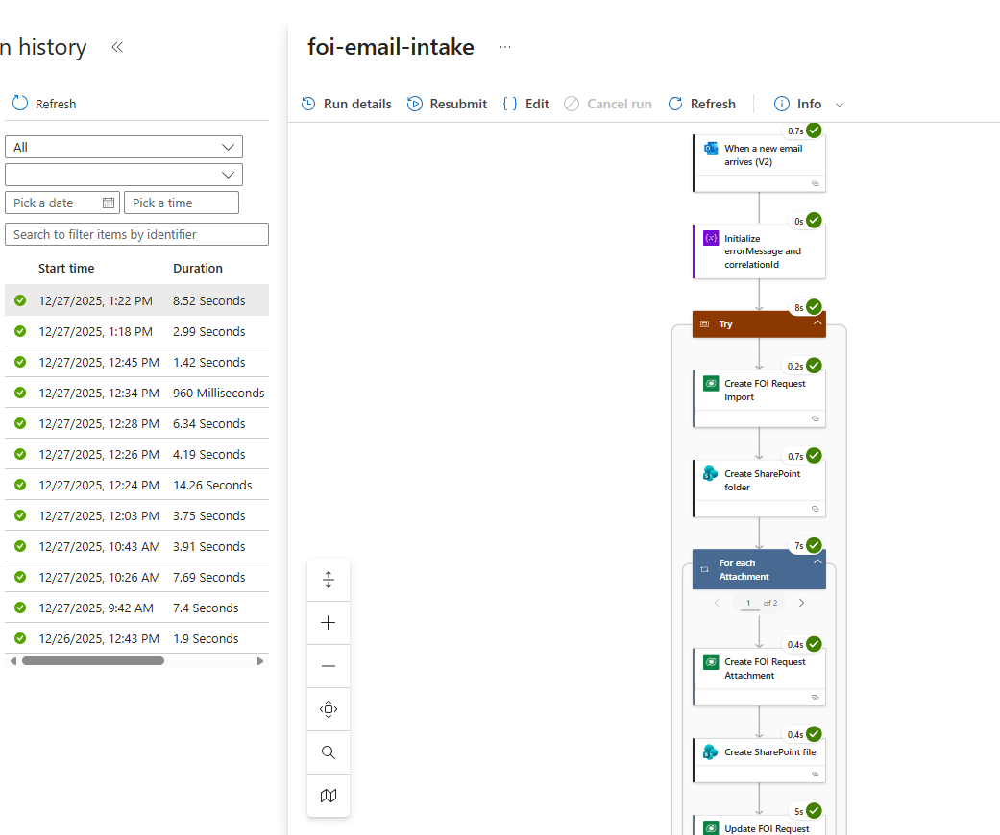
*Logic App Run History – Email Intake: Successful execution showing email trigger, Dataverse record creation, and SharePoint file upload steps.*
  

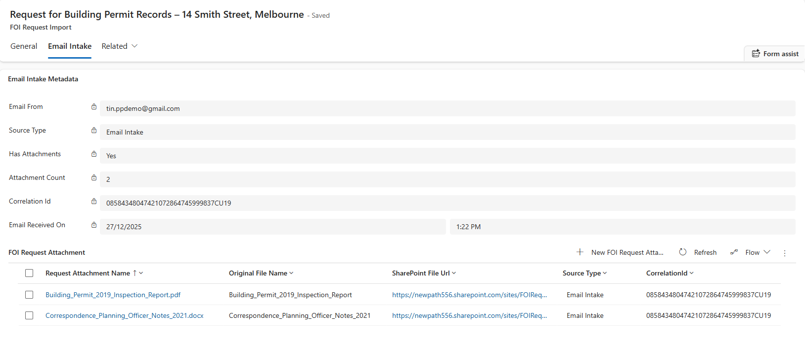
*FOI Request Import – Email Intake Metadata: Email sender, intake metadata, attachment count, and CorrelationId are captured automatically by Logic App.*
  

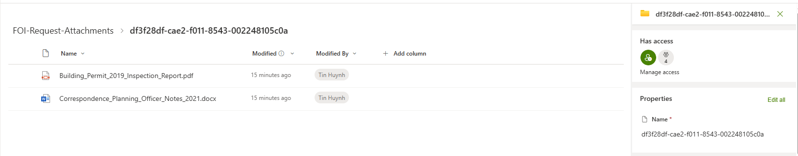
*SharePoint File Upload - Logic App stores inbound email attachments inside a structured folder hierarchy, linked to their FOI Request Import record.*

### Section B - Jurisdiction Validation Flow

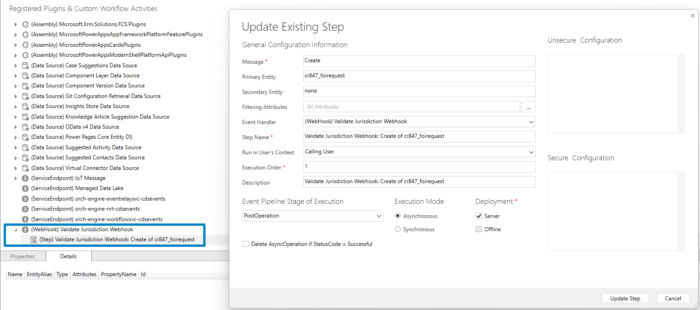
*Webhook Registration - Dataverse async Create step calling Azure Function when a new FOI Request is created.*
  

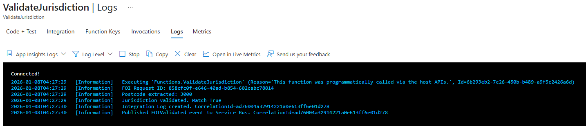
*Azure Function Execution - Function triggered, postcode validated, correlation ID logged, Integration Log written.*
  

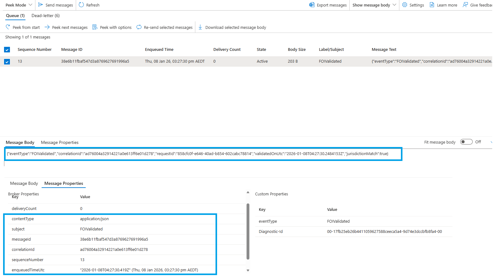
*Service Bus message - FOIValidated event published to queue with correlation ID and validation payload.*
  

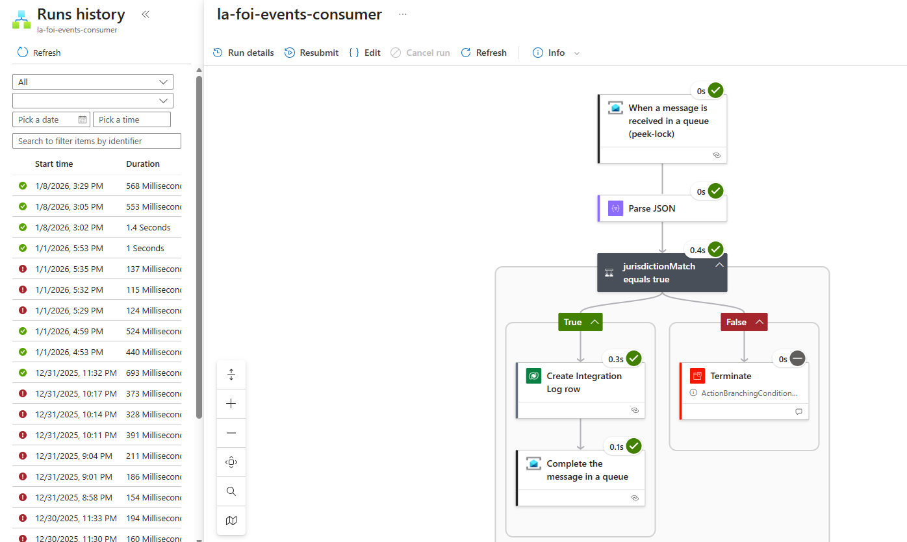
*Logic App consumer - Message received, JSON parsed, downstream Integration Log created successfully.*

### Section C - Integration Logs

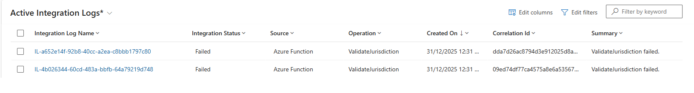
*List of failed integration attempts, showing operation name, status, and timestamps for quick triage.*
  

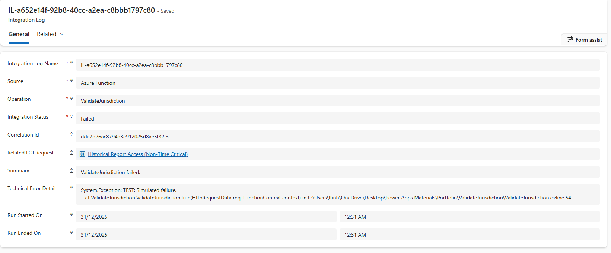
*Expanded failure record with technical error details and linked FOI Request for accurate root-cause diagnosis.*