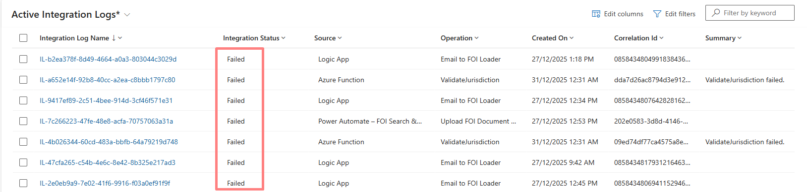
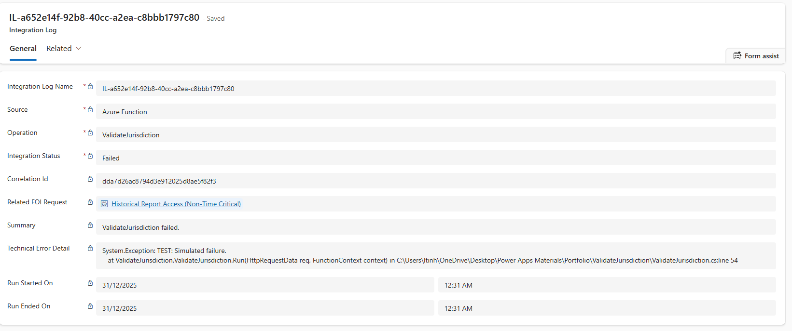

# Operational Reliability & Supportability

## Problem

In regulated and enterprise environments, automated processes and integrations will inevitably fail due to factors outside the developer’s control:

- Invalid or incomplete data  
- Permission or environment differences  
- External system outages  
- API or SharePoint throttling  
- Email ingestion inconsistencies  
- Network latency or transient faults  

When these failures are not **captured**, **centralised**, and **searchable**, support teams face significant challenges:

- Failures become hidden inside individual flow/function run histories  
- Troubleshooting requires elevated platform access  
- Errors remain invisible until users report them  
- Root cause analysis becomes slow and inconsistent  
- Production incidents escalate unnecessarily  

This erodes trust in the system and increases operational risk.

---

## What I Built

I implemented a **consistent, system-wide reliability pattern** across all automated processes, independent of the underlying technology (Logic Apps, Power Automate, Azure Functions, Dataverse Webhooks).

This pattern includes:

- Standardised **Try–Catch** structure across automated processes  
- Selective use of **Finally** blocks where cleanup or return responses are required   
- **Centralised Integration Log** table that stores failures as structured data  
- **Row-level tracking** with correlation IDs linking multi-step processes 
- Consistent capture of:
  - Operation name
  - Integration Status (Success / Failed)
  - Outcome Summary
  - Technical error details (where relevant)
  - Correlation Id
  - Created On (Timestamp)
  - Related FOI request
- Clear separation between:  
  - **Technical error detail**  
  - **Business-readable summary**
- No dependency on run history or email notifications  
- **Selective email alerting** for critical integration failures
- **Support-friendly visibility** directly inside Dataverse  

This creates predictable, diagnosable, and supportable behaviour across the entire FOI ecosystem.

### Applied Across All Automated Processes

This reliability pattern is implemented consistently across:

- Email ingestion  
- Jurisdiction validation  
- Document handling  
- Service Bus downstream actions  
- Any asynchronous or multi-step integration  

Every integration pipeline follows the same design, ensuring predictable diagnostics and eliminating one-off, inconsistent error handling approaches.

---

## How the Reliability Pattern Works

### **1. Try Phase**
Execute the primary business logic: importing, validating, transforming, or routing data.

### **2. Catch Phase**
On failure:

- Write a structured failure record to the Integration Log  
- Capture **Correlation Id** and **process context**, allowing support to trace how a request moved through different integration steps.
- Store both **summary** and **detailed technical messages**  
- Mark status as **Failed**  

Failures are stored as data, not hidden inside run histories.

### **3. Finally Phase**
Used only in flows that must return a response regardless of outcome. 
In this solution, the Finally block returns a success/error payload, or the newly created SharePoint folder path back to the Canvas App caller.

### **4. Email Alerting**
In addition to centralised logging, selective email alerting is implemented for high-impact integration failures where immediate awareness is required (e.g. SharePoint integration failures).
Alerts are triggered only for actionable failure scenarios, and include:
- Integration name
- Correlation ID
- High-level failure summary
Email notifications are used as a signal, while the Integration Log remains the source of truth for investigation and resolution.
---

## Why This Matters

### **Reliability**
Failures are handled consistently without breaking FOI Request creation or other core processes.

### **Traceability**
Every failed operation becomes a searchable data record with correlation IDs.

### **Supportability**
Support teams can investigate issues without requiring access to:

- Power Automate  
- Logic Apps  
- Azure Portal  

Everything is visible in Dataverse & Model-Driven App.

### **Faster Root Cause Analysis**
Clear distinction between business-readable summary and technical details accelerates diagnosis.

### **Enterprise Alignment**
Follows established enterprise integration patterns.

---

## How Support Teams Use This (Operational Workflow)

1. A user reports an issue or an automated alert is triggered.  
2. Support opens the **Integration Log** view and searches by Integration Log number to locate the relevant record. 
3. The log clearly identifies where the issue occurred:
   - Email ingestion  
   - Jurisdiction validation  
   - Document handling  
   - Downstream Service Bus processing  
4. Support can diagnose the cause without elevated Azure/Power Automate permissions.  
5. Only genuine errors are escalated to developers, reducing noise and improving response times.

This workflow ensures predictable, support-friendly production behaviour.

---

## Support Model (Post Go-Live)

### BAU Support
- User access and security role issues  
- Data correction and controlled reprocessing  
- Handling of known validation and business rule errors  

### Platform Support
- Power Automate flow failures and controlled retries  
- Connector authentication and connection reference issues  
- Minor application and configuration changes within approved boundaries  

### Engineering Support
- Dataverse schema changes  
- New or modified system integrations  
- Plugin, custom code, and solution updates via ALM  

### Out of Scope
- Direct production data edits  
- Emergency hotfixes outside approved ALM processes  
- Use of unsupported or non-approved connectors

---

## Screenshots

The following screenshots demonstrate the supportability pattern in action:

 
*Centralised list of failed operations*
  

 
*Full error details and related request for quick diagnosis*