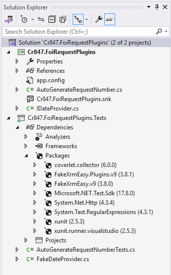
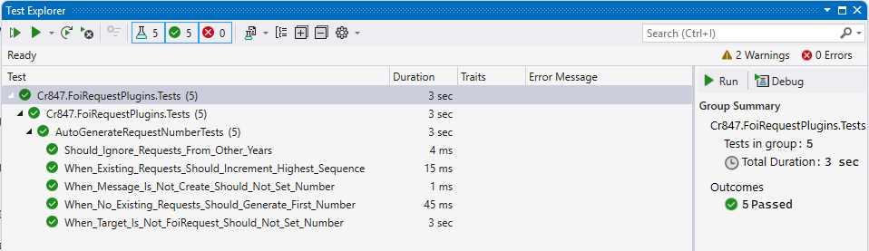

# Testing & Verification

## Problem
In enterprise systems, changes introduce risk:
- Data migrations can corrupt records
- Integrations can fail silently
- Workflow changes can break downstream logic
- Server-side plugins can regress unexpectedly

Without structured testing, issues are often:
- Discovered late
- Hard to reproduce
- Found only after deployment
- Dependent on individual knowledge rather than repeatable checks

---

## What I Implemented
A **practical testing approach** aligned with how Power Platform / Dynamics 365 solutions are tested in real enterprise teams.

This combines:
- **Automated unit testing** for critical server-side logic
- **Scenario-based manual testing** for integrations, migrations, and workflows

---

## Automated Unit Testing (Plugins)
Automated tests were added for critical server-side logic where determinism and correctness matter most.

- Unit tests written using **FakeXrmEasy and xUnit**
- Covers the auto request number generation plugin
- Tests validate:
  - Correct number generation
  - Edge cases and invalid states
  - Regression safety when plugin logic changes
- Tests can be run locally without a Dataverse environment

This reduces regression risk and increases confidence during solution changes and deployments.

---

## Scenario-Based Testing (Flows, Migrations, Workflows)
For areas where automated testing is less practical, **defined test scenarios** were used.

- Written test plans were used to validate:
  - Data migration imports and validation rules
  - SharePoint integrations (create folder, upload file, failure paths)
  - Asynchronous integration using Webhooks, Azure Function, Service Bus, and Logic Apps 
  - FOI Request status transitions and queue routing rules
- Tests were executed manually following defined steps
- Issues identified during testing were fixed and re-tested to stabilise behaviour

This mirrors common enterprise practice where:
- Plugins are unit-tested
- Flows and integrations are validated through repeatable scenarios

---

## Why This Matters
- **Risk reduction**: changes are validated before promotion
- **Stability**: regressions are caught early
- **Repeatability**: tests can be re-run consistently
- **Enterprise realism**: aligns with how Power Platform teams test in production environments

---

## Screenshots

 
*Unit test project structure showing a dedicated test project with xUnit and FakeXrmEasy configured.*
  

 
*Test run summary with all 5 plugin tests passing successfully.*
